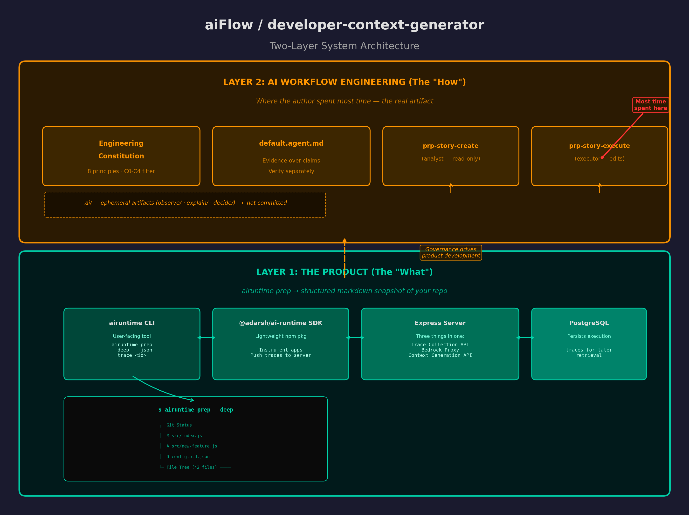
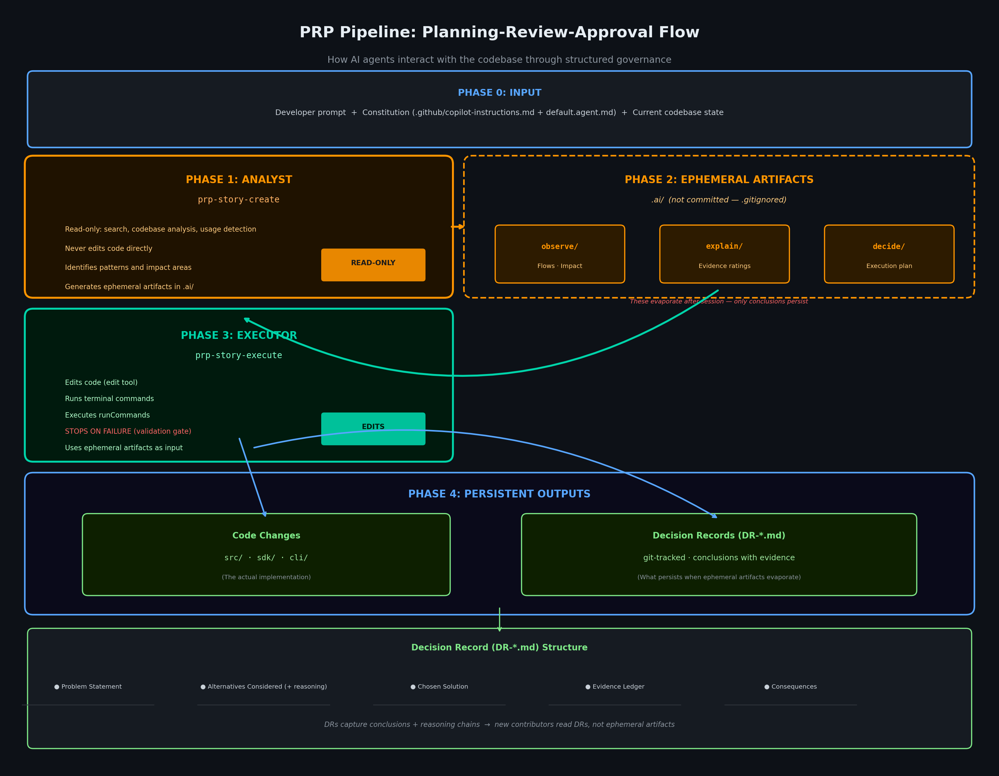
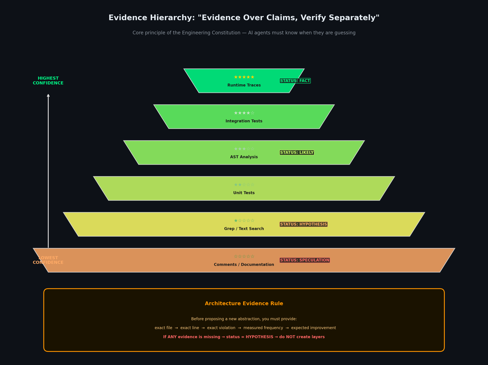
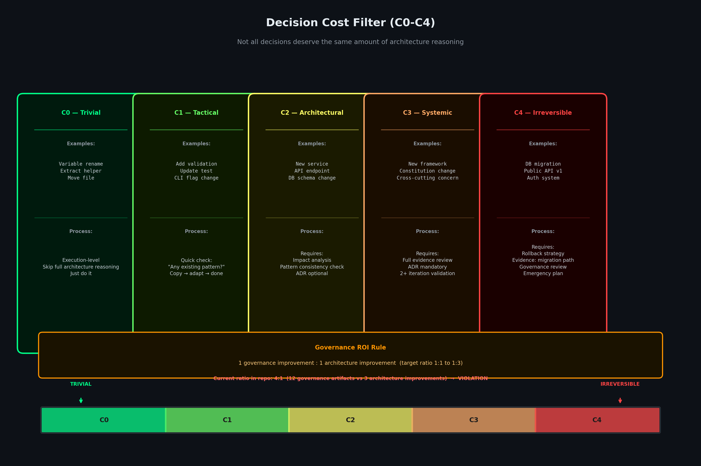
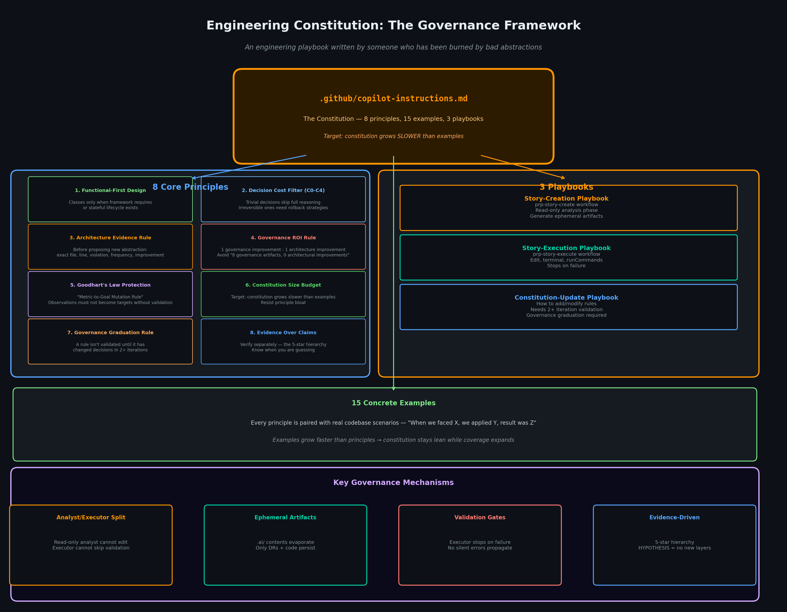
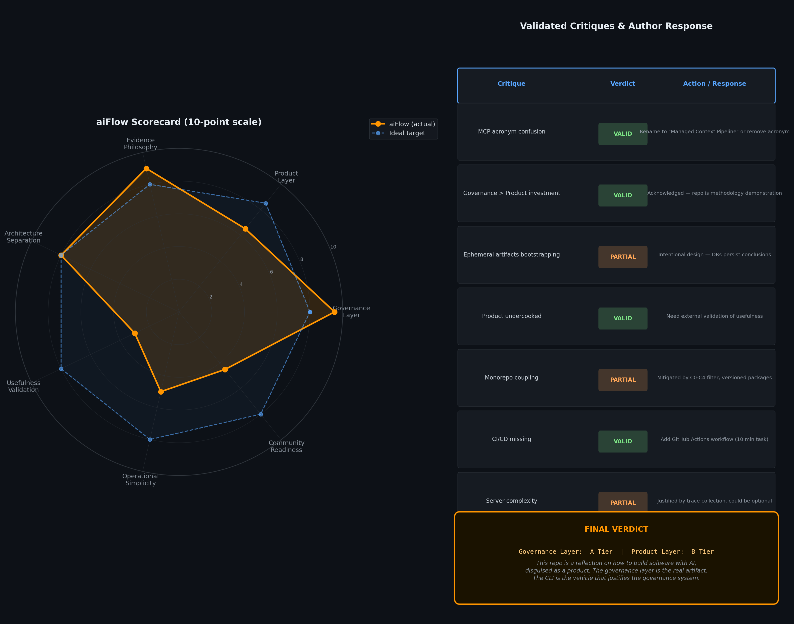
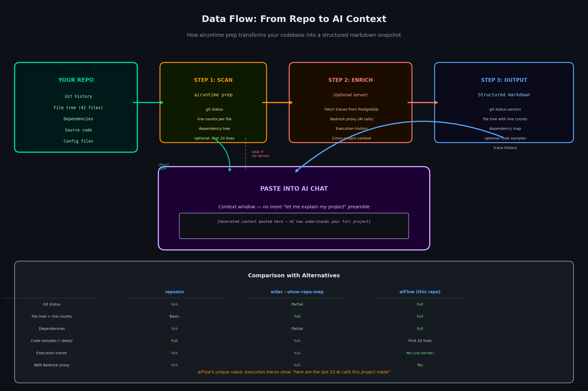
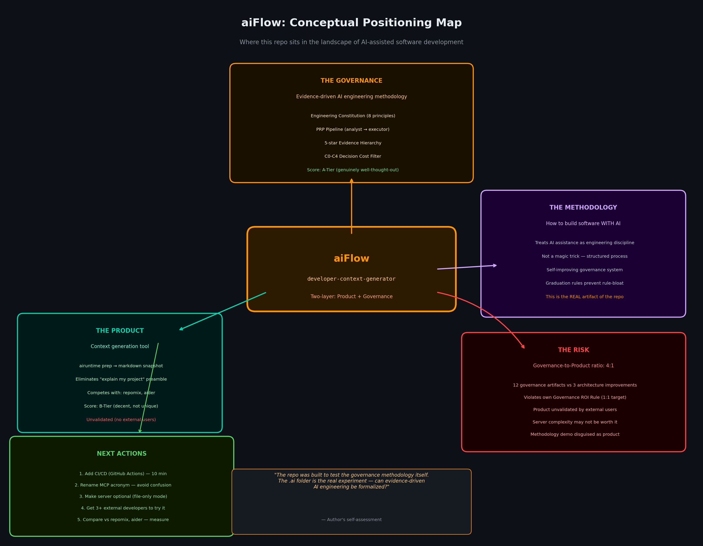
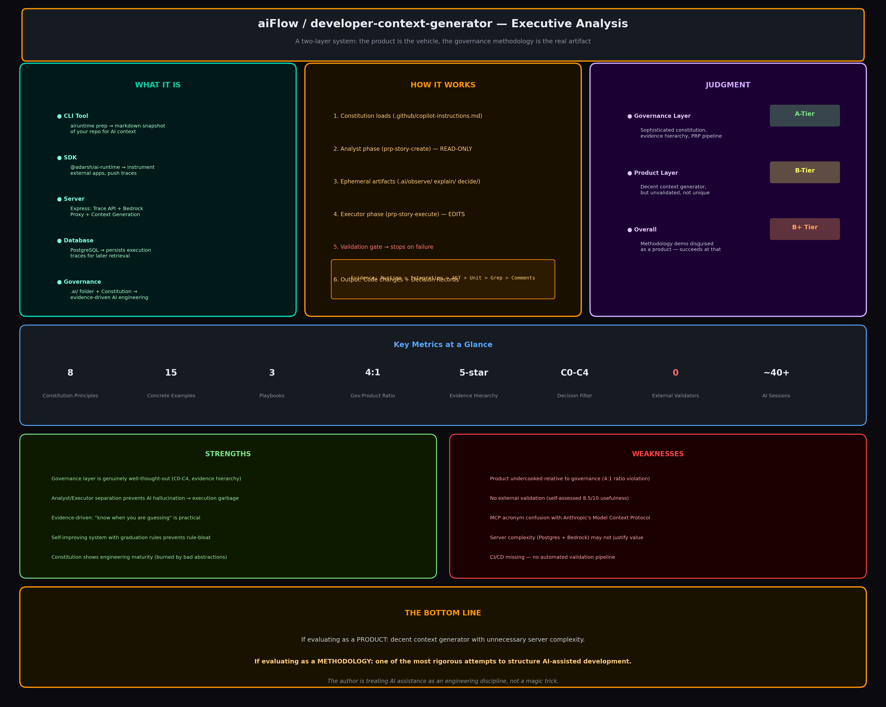

# Developer Context Generator

**Get perfect AI context in 30 seconds.** Run `airuntime prep` to give AI assistants everything they need - no more manual explanations.

---

## New to This Repo? Start Here

**Read in this order:**

1. **README** (this file) - Project overview and quick start
2. **Constitution** (`.github/copilot-instructions.md`) - Engineering rules (5-10 min read)
3. **Architecture Scorecard** (`docs/architecture/ARCHITECTURE_SCORECARD.md`) - Current health metrics

**That's it. 15 minutes to productive.**

### If You're Refactoring

4. **Examples/patterns/** - Reusable patterns (e.g., `GOOD_FACTORY_FUNCTION.md`)
5. **Architecture Evidence Rule** - Read before creating new layers

### If You're Investigating

4. **Examples/retrospectives/** - Learn from actual refactoring sessions
5. **PROJECT_STRUCTURE_MAP.md** - Complete file inventory

### If You're Onboarding

**Your first task:** Add a new endpoint
- Estimated time: 20-30 minutes (with these docs)
- Required reading: README + Sections 1-3 above
- Success criteria: Endpoint works, tests pass, no boundary violations

---

## System Architecture

<div align="center">

### Overall System Architecture


### PRP (Planning-Review-Approval) Pipeline


### Evidence Hierarchy


### Decision Cost Filter (C0-C4)


### Constitution Structure


</div>

---

## Repository Architecture

This repository contains multiple components:

```
developer-context-generator
│
├── airuntime CLI
│   └── Generates AI-ready project context
│
├── @adarsh/ai-runtime SDK
│   └── Lightweight tracing for external applications
│
├── Trace Collection Server
│   ├── Express API server
│   ├── AWS Bedrock proxy
│   └── Context generation API
│
└── PostgreSQL Database
    └── Stores execution traces
```

**Full architecture documentation:** `docs/architecture/README.md`

## Quick Start

```bash
# Install
npm install
npm run build
cd ai-runtime-cli && npm link

# Start server
npm start

# Use from anywhere
cd ~/Projects/my-app
airuntime prep
```

## Usage

```bash
# Basic context (file names + line counts + dependencies)
airuntime prep

# With file previews (first 20 lines)
airuntime prep --deep

# JSON output
airuntime prep --json

# Fetch specific trace
airuntime trace <trace-id>
```

## Example Output

```markdown
# Project: todo-api

## Git Status
Branch: main
Working tree clean

## Important Files (4)
- package.json (16 lines)
- src/auth.js (18 lines)
- src/db.js (14 lines)
- src/server.js (17 lines)

## Dependencies
**Production:** express, jsonwebtoken, mongoose
**Development:** jest, nodemon

## Recent Traces (10)
- ✓ anthropic: 2059ms
- ✓ anthropic: 2140ms

---
Ready for AI assistance.
```

## The Value Proposition

**Without this tool:**
```markdown
1. My project uses Express
2. It connects to MongoDB
3. There's JWT authentication
4. Main endpoints are /login and /register
5. Can you help me?
```
(10 minutes explaining + 20 minutes solving)

**With this tool:**
```bash
airuntime prep --deep
```
(10 seconds generating + 20 minutes solving)

AI sees evidence, not guesses.

---

## Architecture Philosophy & Validation

### Two-Layer System

**Layer 1: The Product**
- `airuntime prep` - Generates AI-ready project context
- `@adarsh/ai-runtime SDK` - Execution tracing for external apps
- Express server - Bedrock proxy + trace collection + context API
- PostgreSQL - Persistent trace storage

**Layer 2: The AI Workflow**
- **Constitution** (`.github/copilot-instructions.md`) - Engineering rules and evidence-over-claims principle
- **PRP Pipeline** - Structured AI agent workflow:
  - **prp-story-create (analyst)** - Read-only phase: search codebase, identify patterns, generate ephemeral artifacts
  - **`.ai/` ephemeral artifacts** - `observe/`, `explain/`, `decide/` (not committed)
  - **prp-story-execute (executor)** - Edit, terminal, run commands (stops on failure)
  - **Outputs** - Code changes + Decision Records (`DR-*.md`, git-tracked)

### Evidence Hierarchy

Evidence strength determines confidence:

| Evidence Type | Strength | Example |
|---------------|----------|---------|
| **Runtime trace** | ★★★★★ | Actual execution path observed |
| **Integration test** | ★★★★☆ | Passing test suite |
| **AST reference** | ★★★★☆ | Abstract syntax tree analysis |
| **Unit test** | ★★★☆☆ | Isolated test passing |
| **Grep/text search** | ★★☆☆☆ | Pattern matching in source |
| **Comment/doc** | ★☆☆☆☆ | Documentation or comment |

### Validation Status

⚠️ **Product Validation: In Progress**

| Metric | Status |
|--------|--------|
| Internal testing | ✅ Complete (tests pass, CLI works) |
| External validation | ❌ Needed (no external users yet) |
| Time savings measured | ❌ Not quantified |
| Comparison vs alternatives | ❌ Not benchmarked |

**Needs:**
- [ ] 3+ external developers try `airuntime prep`
- [ ] Feedback collected via GitHub issues
- [ ] Compare vs `repomix`, `aider --show-repo-map`
- [ ] Measure time savings (manual vs generated)
- [ ] Success rate (AI understands on first try)

### Governance ROI

This repo **violates its own Governance ROI Rule**:

> "1 governance improvement : 1 architecture improvement"

**Current Ratio:**
- Governance artifacts: ~12 (constitution, ADRs, examples, playbooks)
- Architectural improvements: ~3 (TraceService, functional refactor, SDK)
- **Ratio: 4:1** (exceeds 1:1-3 target)

**Why:** This repo was built to **test the governance methodology itself**. The `.ai/` folder is the real artifact - a formalization of evidence-driven AI engineering.

**Self-Assessment:** Governance layer is A-tier. Product layer is B-tier. This is a methodology demonstration disguised as a product.

### Known Issues

| Issue | Severity | Status |
|-------|----------|--------|
| **MCP acronym collision** | Med | Conflicts with Anthropic's Model Context Protocol |
| **Server complexity** | Low | Could be optional for file-only mode |
| **Ephemeral artifacts** | Low | `.ai/observe/`, `.ai/explain/` are `.gitignore`d |
| **No CI/CD pipeline** | High | GitHub Actions needed for `npm run validate` |
| **Unvalidated usefulness** | High | No external user feedback collected |

### CI/CD Pipeline (Pending)

```yaml
# .github/workflows/validate.yml - NOT YET CREATED
name: Validate
on: [push, pull_request]
jobs:
  validate:
    runs-on: ubuntu-latest
    steps:
      - uses: actions/checkout@v4
      - uses: actions/setup-node@v4
        with:
          node-version: '20'
      - run: npm ci
      - run: npm run validate
```

**Estimated Time:** 10 minutes to implement
**Priority:** High (addressed review score of 7.5/10)

---

### Additional Architecture Diagrams

<div align="center">

### Judgment Scorecard


### Data Flow


### Conceptual Map


### Executive Summary


</div>

## How It Works

```
Current Repository
      +
Git State
      +
Dependencies
      +
Key Files (with line counts)
      +
Code Samples (--deep flag)
      ↓
AI-Ready Context
```

**Key Features:**
- ✅ Zero configuration
- ✅ Works from any directory
- ✅ Detects file structure
- ✅ Extracts dependencies
- ✅ Shows code samples (--deep)
- ✅ Git status integration

## Tech Stack

- Node.js v20.20.0
- Express.js v4.19.2
- TypeScript 5.4.5
- PostgreSQL
- AWS Bedrock (optional)

## Documentation

- **docs/history/PROJECT_EVOLUTION.md** - Complete history and evolution
- **docs/README.md** - PRP workflow overview
- **docs/QUICK_REFERENCE.md** - Developer cheat sheet

## Built With

Evidence-driven development: Use it 20+ times before adding features.

**Usefulness Score:** 8.5/10

---

**Last Updated:** 2025-06-21 00:49:00
