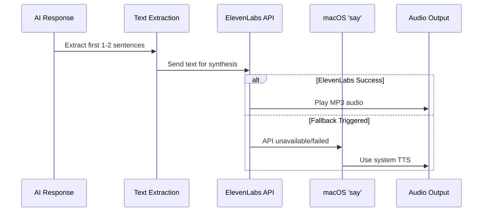

# ElevenLabs Voice Integration

## Overview

The proxy now uses ElevenLabs text-to-speech for high-quality voice summaries instead of the basic macOS `say` command.

## Setup

1. **Get API Key**: Visit [ElevenLabs API Keys](https://elevenlabs.io/app/settings/api-keys) to get your API key

2. **Configure Environment**: Add your API key to `.env`:
   ```
   ELEVENLABS_API_KEY=your_api_key_here
   ```

3. **Install Dependencies**: Already done (`@elevenlabs/elevenlabs-js`)

## Features

### Voice Quality
- Uses Rachel voice (`JBFqnCBsd6RMkjVDRZzb`) - natural, professional sounding
- `eleven_multilingual_v2` model for high-quality synthesis
- MP3 format at 44.1kHz for optimal playback quality

### Automatic Fallback
The system automatically falls back to macOS `say` command if:
- `ELEVENLABS_API_KEY` is not configured
- ElevenLabs API call fails
- Running on non-macOS platforms (macOS only)

### Usage

The voice summary is automatically called in two scenarios:

1. **Bedrock streaming completion** (`src/bedrock.ts`):
   ```typescript
   if (stopReason === 'end_turn') {
     playChatCompletionSoundAsync();
     await speakSummary(responseText.join(''), toolCount);
   }
   ```

2. **OpenAI-format completion** (`src/bedrock.ts`):
   ```typescript
   if (finishReason !== 'tool_calls') {
     playChatCompletionSoundAsync();
     await speakSummary(responseText.join(''));
   }
   ```

## Configuration

### Voice Selection
To change the voice, update `VOICE_ID` in `src/utils/voice-summary.ts`:
- Rachel (default): `JBFqnCBsd6RMkjVDRZzb`
- Find more voices at: https://elevenlabs.io/app/voice-library

### Debug Mode
Enable debug logging to troubleshoot:
```
DEBUG_VOICE=true
```

## Flow Diagram



## Text Processing

The summary extraction logic (`extractFirstSentences`):
1. Strips markdown (code blocks, headers, bold/italic)
2. Extracts first 1-2 sentences
3. Caps at 200 characters
4. Falls back to "Done" if no content

## Cost Considerations

ElevenLabs uses character-based pricing:
- Free tier: 10,000 characters/month
- Paid plans start at $5/month for 30,000 characters
- Typical summaries: ~50-200 characters per request

To optimize costs:
- Summaries are capped at 200 characters
- Fallback to `say` command when API unavailable
- Only plays on `end_turn` or non-tool completions

## Testing

Test the integration:
```bash
# Set your API key in .env
npm run build
npm run dev

# Make a request that will trigger a summary
# Listen for audio playback after completion
```

## Troubleshooting

**No audio plays**:
1. Check `ELEVENLABS_API_KEY` is set in `.env`
2. Verify API key is valid at https://elevenlabs.io/app/settings/api-keys
3. Enable debug mode: `DEBUG_VOICE=true`
4. Check for error messages in console

**Fallback to 'say' command**:
- Expected when API key not configured
- Verify `.env` file is in project root
- Restart server after adding API key

**Poor audio quality**:
- Current config: MP3 44.1kHz 128kbps
- Change `outputFormat` in `speakSummary()` for different quality
