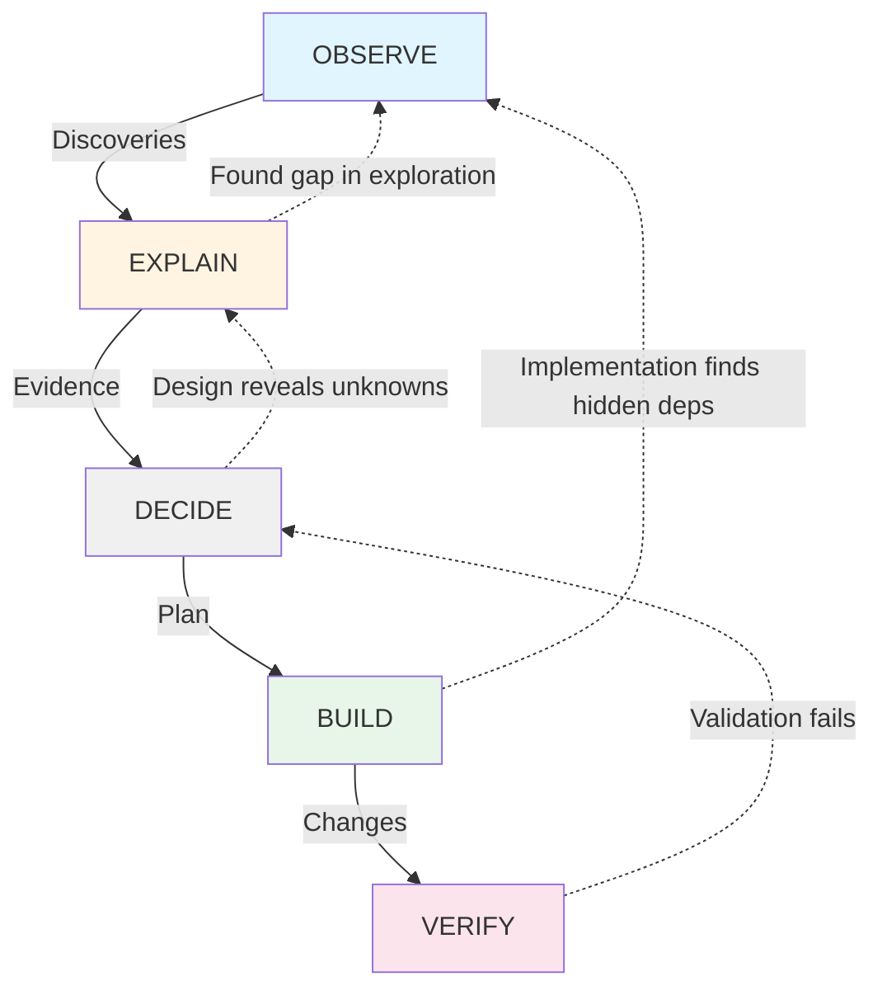

# Evidence-Driven Engineering System

## Overview

MCP 1.0.0 now implements an **evidence-driven engineering workflow** that goes beyond simple prompt engineering. This is a complete methodology for engineering knowledge that compounds over time.

---

## Evolution: From Task Lists to Evidence Architecture

### Before (Traditional PRP)
```
User Story → Plan → Execute
            ↓
      Task 1, 2, 3...
```

**Problem:** Task lists don't capture *why* decisions were made or *what evidence* supports them.

---

### After (Evidence-Driven)
```
User Story
    ↓
OBSERVE → EXPLAIN → DECIDE
    ↓         ↓        ↓
 BUILD → VERIFY
```

**Benefit:** Each phase produces evidence-backed artifacts that persist and compound.

---

## The Five Phases

### 1. OBSERVE (Discover What Exists)
**Goal:** Map the territory before changing it

**Outputs:**
- Architecture diagrams
- Runtime flow maps
- Impact analysis (dependency chains)
- Unknowns list

**Tools:** Codebase search, dependency analysis, static analysis

**Artifact:** `.ai/observe/[feature]-observe.md`

**Example:**
```markdown
Architecture:
- Gateway: src/server.ts (Express)
- Translator: src/adapters.ts
- Client: src/bedrock.ts (AWS SDK)

Runtime Flow:
/v1/messages → server.ts → adapters.ts → bedrock.ts → Bedrock

Impact Analysis:
STATIC_MODEL_ID affects:
  - adapters.ts:7 (definition)
  - server.ts:42 (response)
  - bedrock.ts:28 (streaming)
```

---

### 2. EXPLAIN (Analyze With Evidence)
**Goal:** Every claim has evidence backing it

**Outputs:**
- Observations with evidence citations
- Evidence strength ratings (★★★★★)
- Inferences and confidence levels
- Risk assessments

**Tools:** AST analysis, runtime traces, test execution, grep

**Artifact:** `.ai/explain/[feature]-explain.md`

**Evidence Hierarchy:**
| Type | Strength | Example |
|------|----------|---------|
| Runtime trace | ★★★★★ | Actual execution observed |
| Integration test | ★★★★☆ | Passing test suite |
| AST reference | ★★★★☆ | Code structure analysis |
| Unit test | ★★★☆☆ | Isolated test passing |
| Grep search | ★★☆☆☆ | Text pattern match |
| Comment/doc | ★☆☆☆☆ | Documentation |

**Example:**
```markdown
Observation: Gateway uses single model ID
Evidence: 
  - src/adapters.ts:7 - STATIC_MODEL_ID = 'zai.glm-5'
  - Strength: ★★★★☆ (AST reference)
Inference: All requests route to same model
Inference Strength: High
Confidence: High (derived from strong evidence)
Risk: Medium - Could break if model ID changes
```

---

### 3. DECIDE (Design Execution Plan)
**Goal:** Document alternatives and choose with reasoning

**Outputs:**
- Task breakdown (CREATE/UPDATE/ADD/REMOVE/REFACTOR/MIRROR)
- At least 2 alternatives per decision
- Validation strategy
- Rollback plan

**Tools:** Design thinking, risk analysis

**Artifact:** `.ai/decide/[feature]-decide.md`

**Example:**
```markdown
Decision: Derive model field from STATIC_MODEL_ID

Alternatives:
Option A: Keep separate references
  - Pros: Easier testing
  - Cons: Risk of drift
  - Evidence: None (status quo)
  
Option B: Derive from STATIC_MODEL_ID (CHOSEN)
  - Pros: Single source of truth
  - Cons: Refactor 3 files
  - Evidence: EL-001, EL-002

Reasoning: Option B eliminates drift, evidence shows STATIC_MODEL_ID is authoritative.

Validation:
  - Tests: npm test
  - Manual: curl endpoints
  - Integration: Check streaming responses

Rollback: git revert [commit-hash]
```

---

### 4. BUILD (Implement with Evidence)
**Goal:** Execute with traceability

**Actions:**
- Print Execution Summary BEFORE editing
- Implement task-by-task
- Run validation after EACH task
- Show actual output (not "it should work")

**Tools:** Code editing, test execution, build commands

**Principles:**
- Each change traces to EXPLAIN evidence
- Validation gates after each task
- Stop on failure (don't proceed with broken state)

**Example:**
```
═════════════════════════════════════════════════════
EXECUTION SUMMARY
═════════════════════════════════════════════════════

Files to Change:
  ✓ adapters.ts (UPDATE)
  ✓ server.ts (UPDATE)

Risk Level: LOW

Validation Plan:
  □ Build: npm run build
  □ Tests: npm test
  □ Manual: curl localhost:3000/v1/models

═════════════════════════════════════════════════════

TASK 1: UPDATE adapters.ts:7
Evidence: EL-001 (STATIC_MODEL_ID is authoritative)
Diff: [exact changes]
Validation: ✓ Build passes, ✓ Tests pass
```

---

### 5. VERIFY (Independent Validation)
**Goal:** Holistic validation after all tasks complete

**Outputs:**
- Build status
- Test results with coverage
- Integration checks
- Performance regression check
- Security scan

**Tools:** Test runners, linters, integration tests

**Artifact:** Validation report in execution log

**Example:**
```
═════════════════════════════════════════════════════
VALIDATION RESULTS
═════════════════════════════════════════════════════

Build: PASS
  [output]

Tests: PASS (12/12)
  Coverage: 85%

Integration: PASS
  ✓ /v1/models returns correct model
  ✓ /v1/messages returns correct model
  ✓ Streaming works

Performance: CHECK
  No regression noted

Security: CHECK
  No new vulnerabilities

═════════════════════════════════════════════════════

VERDICT: READY FOR REVIEW
```

---

## Workflow States (Not Steps!)

**Critical Insight:** These are STATES, not strict SEQUENTIAL STEPS.



**Allow Backtracking:**
- Design might reveal gaps in discovery → return to OBSERVE
- Execution might find hidden dependencies → return to EXPLAIN
- Validation might fail → return to DECIDE or BUILD

---

## Decision Records (Persistent Knowledge)

### What They Are
Long-lived documents explaining **why** code ended up this way.

### Location
`.ai/decision-records/DR-001-feature-name.md`

### Structure
```markdown
# DR-001: [Title]

## Problem
[What problem are we solving]

## Alternatives
Option A: [Description]
Option B: [Description] (CHOSEN)

## Decision
[What we decided]

## Reasoning
[Evidence-based justification]

## Evidence Ledger
EL-001: [Source:line] - [What it shows]
Strength: ★★★★☆

## Consequences
Positive: [Benefits]
Negative: [Tradeoffs]

## Validation
[x] Tests: passing
[x] Runtime: verified

## Status
IMPLEMENTED (2026-06-20)
```

### Purpose
Months later, another engineer can understand:
- What alternatives were considered
- Why this approach was chosen
- What evidence supported it
- What tradeoffs exist

---

## Anti-Patterns to Avoid

### ❌ Don't Build a Giant Knowledge Graph
Too complex, maintenance burden, nobody will use it.

### ✅ Do: Store Markdown in Git
Simple, searchable, version-controlled.

---

### ❌ Don't Store Ephemeral Knowledge
Variable references, function calls, imports → regenerate these.

### ✅ Do: Store Persistent Knowledge
Architectural invariants, design decisions, contracts, domain rules.

---

### ❌ Don't Make Phases Strictly Sequential
Real engineering has loops and backtracking.

### ✅ Do: Allow State Transitions
Return to earlier phases when new evidence appears.

---

### ❌ Don't Trust Low-Evidence Claims
Evidence strength ★★☆☆☆ or below needs verification.

### ✅ Do: Reserve High Confidence for Strong Evidence
★★★★☆ and above → High confidence.

---

## Benefits

### 1. Reduced Hallucinations
Every claim has evidence backing. No "I think" or "probably".

### 2. Better Decisions
Alternatives documented, reasoning explicit, tradeoffs visible.

### 3. Faster Onboarding
New engineers read decision records → understand context quickly.

### 4. Audit Trail
Understand why code ended up this way, not just what it does.

### 5. Compound Knowledge
Evidence ledger grows over time, each decision builds on previous.

---

## Integration with VS Code Copilot

### Commands
```
/prp-story-create → OBSERVE → EXPLAIN → DECIDE
/prp-story-execute → BUILD → VERIFY
```

### Agents
```
prp-analyst: Read-only investigator (OBSERVE → EXPLAIN → DECIDE)
prp-executor: Implementation executor (BUILD → VERIFY)
```

### Workflow
```
User: /prp-story-create
→ Agent: prp-analyst loads
→ Produces: .ai/observe, .ai/explain, .ai/decide artifacts

User: Review plan, approve

User: /prp-story-execute
→ Agent: prp-executor loads
→ Reads: artifacts from above
→ Produces: execution log + validation
→ Creates: Decision record (manual or auto)
```

---

## Recommended Usage

### Small/Trivial Changes
```bash
Direct chat → copilot-instructions.md applies → Default agent
```

### Real Features (Always Use PRP)
```bash
/prp-story-create → Produces evidence-driven artifacts
# Review OBSERVE → EXPLAIN → DECIDE output
# Satisfied? Proceed.

/prp-story-execute → Implements with validation
# Check execution log and validation results
# Create decision record if significant

# Git commit:
git add .ai/decision-records/DR-XXX.md
```

---

## Evolution Roadmap

### Phase 1: Upgrade Prompts ✅
- Evidence ledger system
- Decision records
- Execution summaries
- Validation gates

### Phase 2: Use on Real Tasks (You Are Here)
- Apply to 5-10 real features in mcp1.0.0
- Collect feedback on what works
- Identify what's missing

### Phase 3: Refine Based on Usage
- Which artifacts did you actually read?
- Which sections did you ignore?
- What information was missing?
- What prevented mistakes?

### Phase 4: Scale to Team
- Share decision records across team
- Standardize evidence vocabulary
- Build shared understanding

---

## Key Philosophy

> **Code is transient. Engineering knowledge compounds.**

Most AI workflows optimize for code generation.

This system optimizes for **engineering knowledge**:
- Architectural understanding
- Design decisions
- Evidence-backed reasoning
- Compound insights

The artifacts you create today will help you (and others) months from now, long after the code has changed.

---

## Quick Reference

| Task | Command | Agent | Output |
|------|---------|-------|--------|
| Analyze feature | `/prp-story-create` | prp-analyst | .ai/observe, .ai/explain, .ai/decide |
| Implement plan | `/prp-story-execute` | prp-executor | Execution log, validation |
| Document decision | Manual | - | .ai/decision-records/DR-XXX.md |
| Quick fix | Direct chat | Default | Code changes |

---

**Created:** 2026-06-20  
**Status:** ✅ Implemented  
**Next:** Use on 5-10 real tasks, then refine
